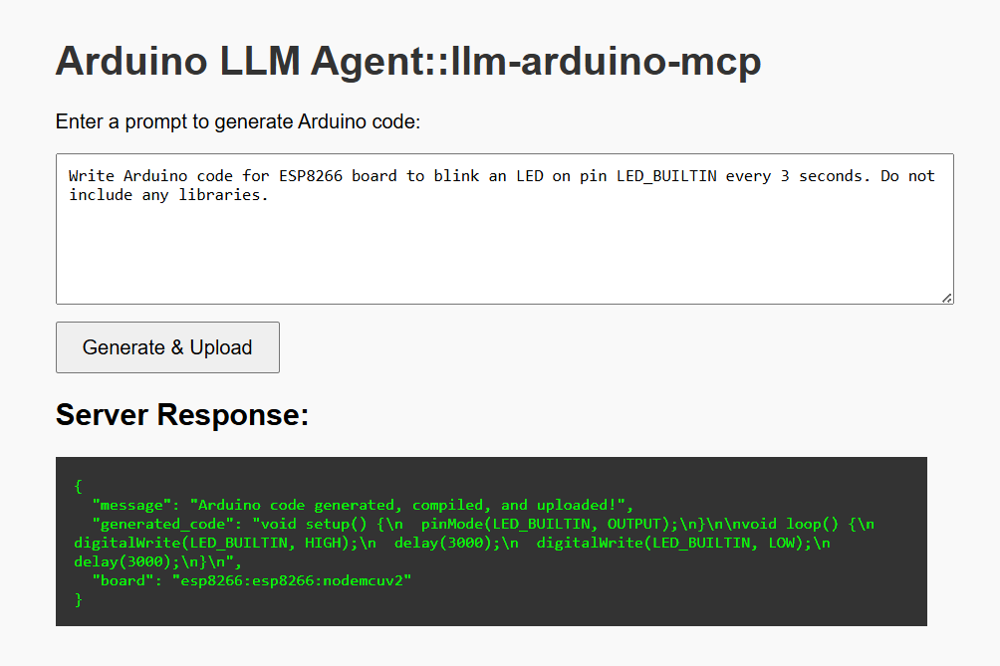

# Arduino LLM Agent
```llm-arduino-mcp```

> An intelligent backend server that uses Large Language Models (LLMs) to generate, compile, and upload Arduino, ESP8266, and ESP32 firmware automatically — powered by Ollama and Arduino CLI.



**LLM + MCP inspired flow**

Generate, compile, and upload Arduino sketches automatically using natural language prompts and local Ollama LLM models.

## Features

- Ollama local LLM API for private codegen
- Automated compile & upload using Arduino CLI
- Supports multiple boards: Arduino Uno, ESP8266, ESP32 — extend easily
- Simple Express API — plug into your own frontend


## Quick Start
1. Install and run Ollama (`ollama serve`)
   - ```ollama run llama3.2```
2. Install and configure `arduino-cli`
3. Clone this repo and `npm run start` (or `bun run` version)
4. Send POST request with your prompt:
   ```bash
   curl -X POST http://localhost:3000/generate-arduino \
     -H "Content-Type: application/json" \
     -d '{"prompt": "Write Arduino code to blink LED on pin 2 using ESP32."}'

---

## MCP (Model Context Protocol) Status

This project partially follows MCP (Model Context Protocol) principles:
- Uses structured system + user roles.
- Passes prompt context in a clear format.
- Automates an external tool (Arduino CLI) based on generated context.

### Planned Improvements for MCP Compliance

- [ ] Add a versioned **Context Registry** for reusable system instructions.
- [ ] Support custom context creation and switching via REST.
- [ ] Standardize request/response payloads to fully align with OpenAI’s Chat API format.
- [ ] Add tool/plugin calls as structured operations.
- [ ] Store complete chain-of-thought and compile/upload logs.
- [ ] Add role-based API auth for context control.

---

The goal is to evolve this project into a reusable, standards-friendly MCP backend for embedded LLM workflows.


## Prerequisites

- Install arduino-cli
  - Refer: https://arduino.github.io/arduino-cli/1.2/


```bash
curl -fsSL https://raw.githubusercontent.com/arduino/arduino-cli/master/install.sh | sh
```
Or download a copy of the Arduino CLI, place it in a directory of your choice, and make sure to add it to your system’s PATH according to your operating system.


```bash
arduino-cli core update-index
arduino-cli core install arduino:avr
arduino-cli core install esp8266:esp8266
arduino-cli core install esp32:esp32
```

  - Add arduino-cli to the system path
- Ensure Ollama is setup on your machine
  - Refer: https://ollama.com/download


## To install dependencies:

```bash
bun install
```

## Update the server.js

- Update Ollama model as per your Ollama setup
  - Tested with llama3.2:latest
- Update Port for you board
```typescript
const OLLAMA_URL = 'http://localhost:11434/api/chat'; // Change if your Ollama server is running on a different port
const SERIAL_PORT = 'COM5';        // Change as per your board
const OLLAMA_MODEL = 'llama3.2:latest'; // Change as per your Ollama setup
```

## To run:

```bash
bun run start
```

# Usage
- Make sure the Arduino Board is attached to the com port
- Run following from the terminal

```bash
curl --location 'http://localhost:3000/generate-arduino' \
--header 'Content-Type: application/json' \
--data '{
    "prompt": "Write Arduino code for ESP8266 board to blink an LED on pin LED_BUILTIN every 3 seconds. Do not include any libraries."
}'

```

---

## Roadmap & Future Improvements

This project is a strong starting point for combining LLMs with embedded automation. Here are planned ideas to take it further:

- [ ] **Web UI Enhancements**
  - Add a proper web frontend with code syntax highlighting (e.g., Ace Editor or Monaco).
  - Display generated code nicely with download or copy buttons.
  - Show compilation logs and upload status in real-time.

- [ ] **Board Management**
  - Add a dropdown in the UI to select supported boards manually.
  - Fetch board list dynamically from a config file (`boards.json`).
  - Auto-detect connected boards and available serial ports.

- [ ] **User Prompts & Templates**
  - Offer ready-made prompt templates for common tasks (blink LED, read sensor, etc.).
  - Add prompt history and re-run support.

- [ ] **Project Files**
  - Allow multiple sketches and auto-archive generated code.
  - Provide an option to download the `.ino` as a zip.

- [ ] **Security & Permissions**
  - Add basic API authentication or API keys.
  - Validate generated code before compile/upload for safety.

- [ ] **Docker & Deployment**
  - Add a Dockerfile to package Ollama, Arduino CLI, and the server together.
  - Provide instructions for deployment on local networks or edge devices.

- [ ] **CI/CD Integration**
  - Use GitHub Actions to lint, test, and deploy the backend.
  - Add unit tests for code block & board parsing.

- [ ] **Extensibility**
  - Support other microcontroller families (RP2040, STM32, etc.).
  - Modular plugin system for new boards or new codegen models.

- [ ] **Monitoring**
  - Add basic logging & metrics for LLM usage, compile stats, success/failure rates.

---

**Want to contribute?**  
Feel free to open an Issue or PR for any of these improvements! Do start the project if you like it.
